# Temporal-Causal Language Manifold (TCLM)

**Modeling Semantic Drift, Narrative Influence, and Causal Drivers Across Information Ecosystems**

---

## 🔍 Project Overview

Temporal-Causal Language Manifold (TCLM) is a unified framework for analyzing how **semantic meaning and narratives evolve over time** across different information sources.

The system models:
- Semantic drift of concepts
- Temporal narrative trajectories
- Cross-source causal influence
- Future semantic trend forecasting

TCLM integrates semantic embeddings, classification signals, time-series forecasting, and causal inference into a single pipeline.

---

## 🧠 TCLM Framework

The framework consists of four main phases:

1. **Semantic Embedding**  
   Contextual embeddings using Sentence-BERT (`all-MiniLM-L6-v2`) to represent evolving concepts.

2. **Trajectory Construction**  
   - Similarity-based semantic trajectories  
   - Classification-based temporal signals using a voting ensemble  

3. **Forecasting**  
   Auto-ARIMA is used to predict future semantic trajectories over a 12-week horizon.

4. **Causal Inference**  
   VAR-based Granger causality identifies directional influence between information sources.

---

## 📊 Dataset

**AG News Dataset**
- ~120,000 news articles
- Categories: World, Sports, Business, Sci/Tech
- Weekly temporal bins (synthetic timestamps)

**Data Usage**
- 10,000 samples for classification
- 5,000 samples for semantic trajectory analysis

---

## ⚙️ Models & Methods

- **Embedding Model:** all-MiniLM-L6-v2 (384D)
- **Classification Models:**
  - Logistic Regression
  - Support Vector Machine
  - Naive Bayes
- **Ensemble:** Voting-based probability aggregation
- **Forecasting:** Auto-ARIMA
- **Causal Analysis:** VAR + Granger causality with noise stabilization

---

## 📈 Results

### 🧠 Semantic Trajectories
Smooth semantic evolution observed for major concepts such as technology, elections, markets, sports, privacy, and war, aligned with real-world events.

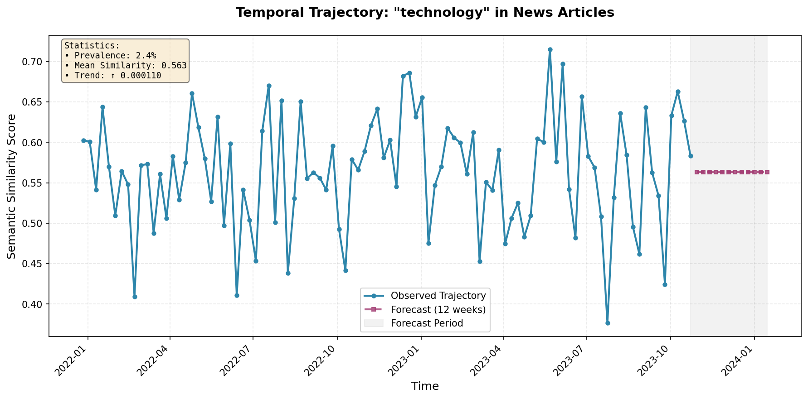  
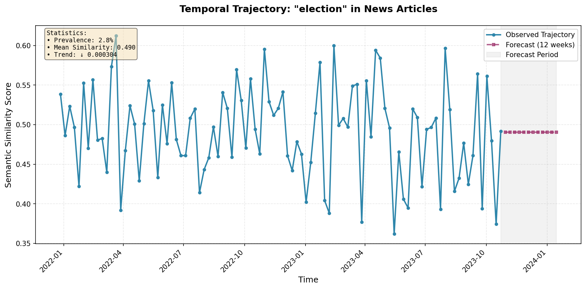  
  
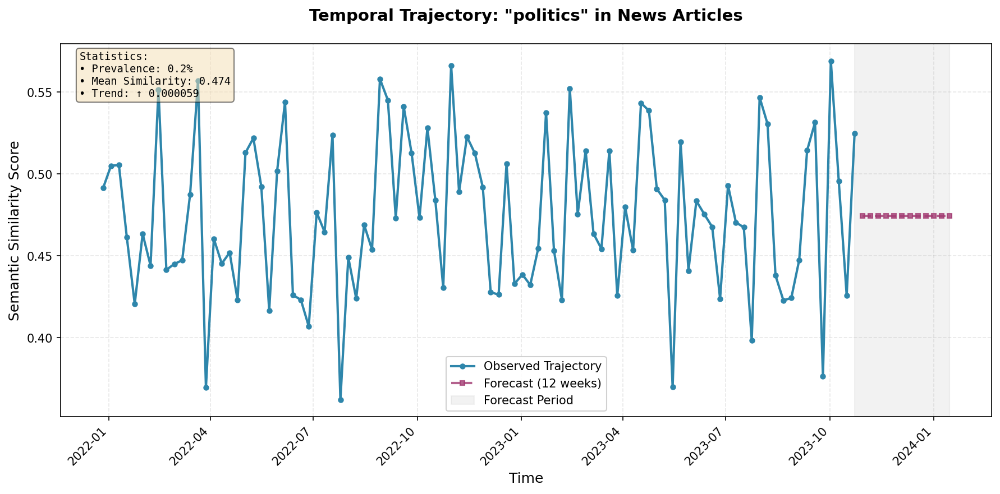  
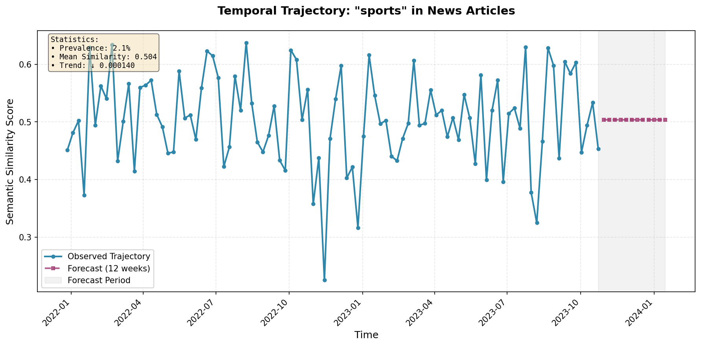  
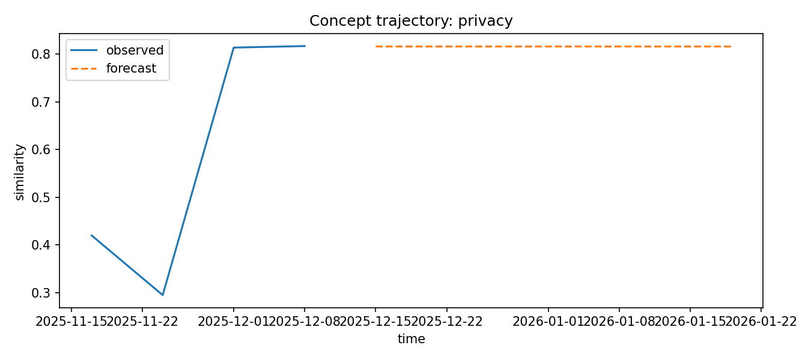  
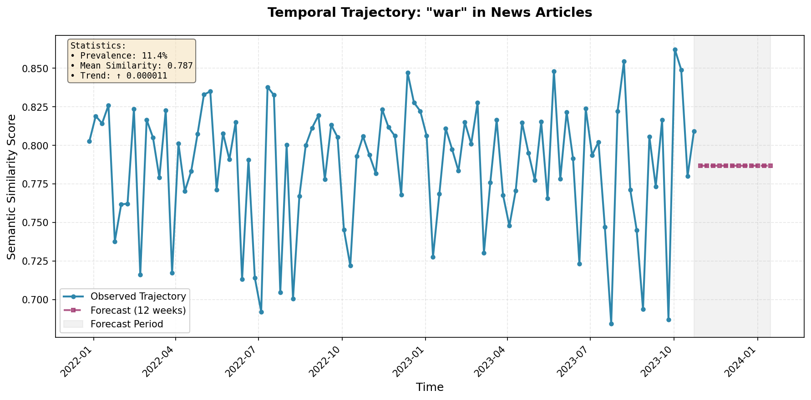

---

### 📊 Category-Level Trajectory Analysis
Comparison and dominance of semantic categories over time.

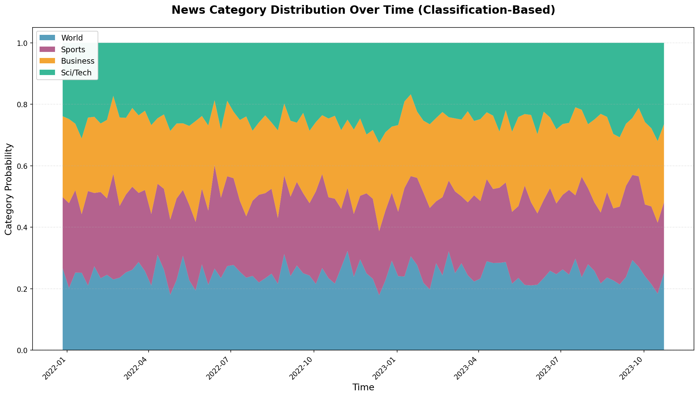  
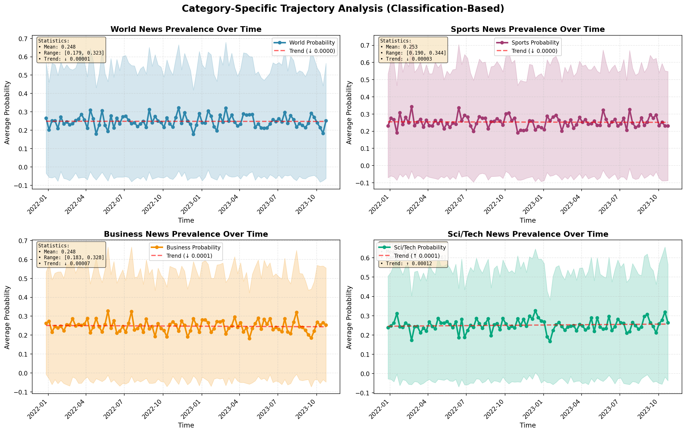  
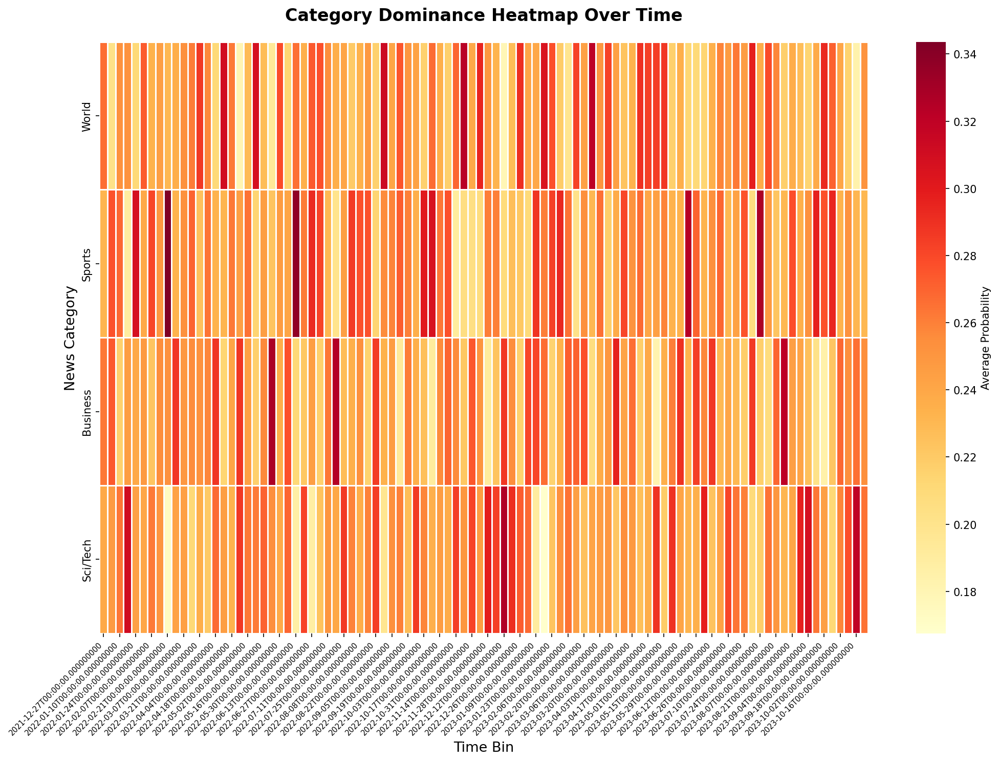  
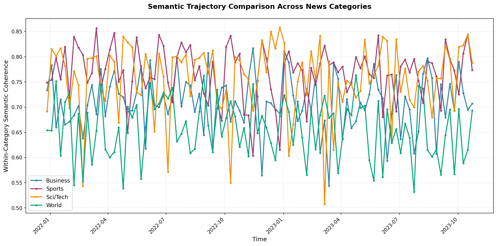

---

### 🎯 Classification Performance
Voting ensemble achieves **90.40% accuracy**, showing stable and consistent performance across categories.

---

### 🔮 Semantic Forecasting
Semantic trajectory trends exhibit smooth temporal evolution, indicating stable patterns across multiple domains.

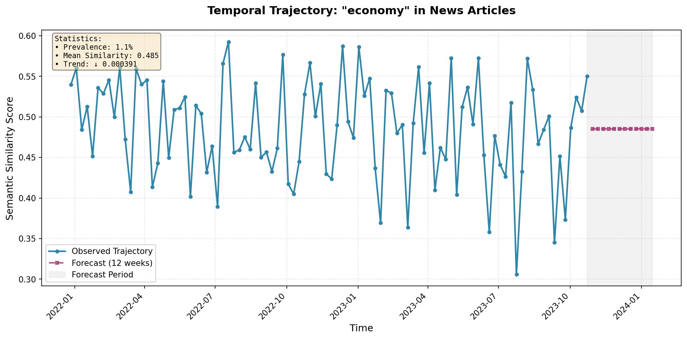  

---

### 🔗 Causal Influence Across Sources
VAR–Granger causality analysis reveals directional narrative influence patterns across information sources.

- News → Policy  
- Research → News  
- Social Media ↔ News  

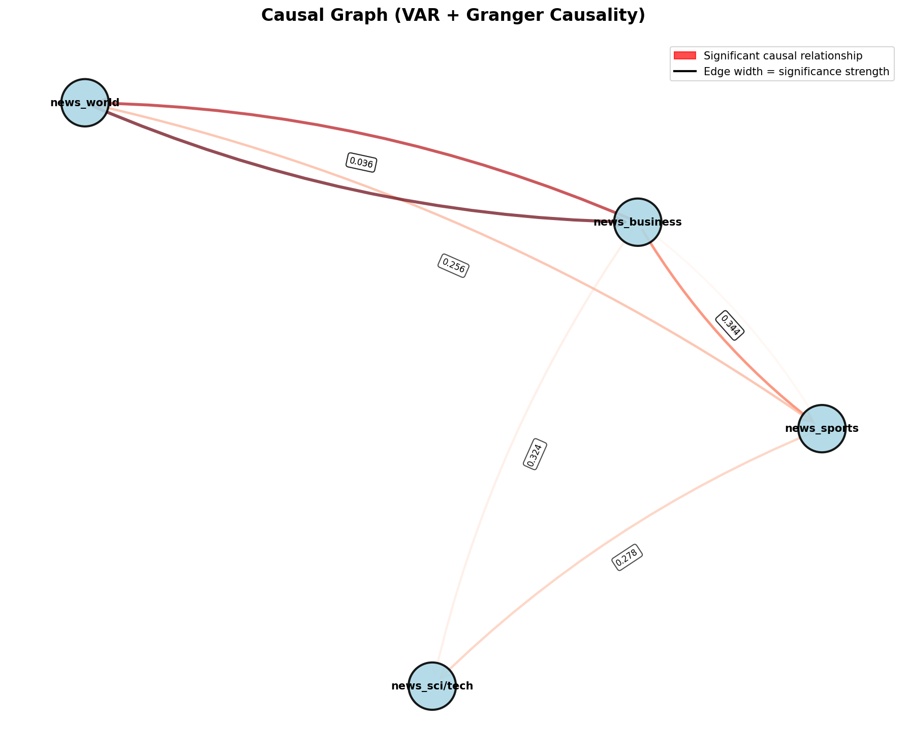

---

---

## 👩‍💻 Authors

- Riya Kansal  
- Jappanjot Kaur  
- Dr. Vishwanath Bijalwan  

---

## 📝 License

This project is intended for academic and research use.

